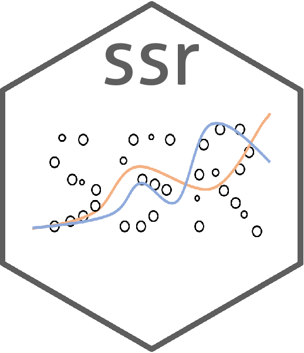

# ssr 

An R package for **semi-supervised regression**.

The **ssr** package implements *Co-training by Committee* and *self-learning* semi-supervised learning (SSL) algorithms for **regression**. In semi-supervised learning, alrgorithms learn model parameters not only from labeled data but also from unlabeled data. In many applications, it is difficult, expensive, time-consuming, etc. to label data. Thus, semi-supervised methods learn by combining the limited labeled data points and the unlabeled data points.

The **ssr** package provides the following functionalities:

* Train Co-training by Committee models.
* Train self-learning models.
* Track and plot performance during training.
* Generate plots to quickly visualize the results.
* Specify the base regressors used by the Co-training committee from the [caret](https://github.com/topepo/caret) package, other packages or custom functions.

## Installation

You can install the development version from GitHub:

```{r}
# install.packages("devtools")
devtools::install_github("enriquegit/ssr", build_vignettes = TRUE)
```

## Example

The following example shows how to train a Co-training Committee of two regressors: a linear model and a KNN.

```{r}
library(ssr)

dataset <- friedman1 # Load friedman1 dataset.

set.seed(1234)

# Prepare de data
split1 <- split_train_test(dataset, pctTrain = 70)
split2 <- split_train_test(split1$trainset, pctTrain = 5)
L <- split2$trainset
U <- split2$testset[, -11] # Remove the labels.
testset <- split1$testset

# Define list of regressors.
regressors <- list("lm", knn=caret::knnreg)

# Fit the model.
model <- ssr("Ytrue ~ .", L, U, regressors = regressors, testdata = testset, maxits = 10)

# Plot RMSE.
plot(model)

# Get the predictions on the testset.
predictions <- predict(model, testset)

# Calculate RMSE on the test set.
sqrt(mean((predictions - testset$Ytrue)^2))

```

For detailed explanations and more examples refer to the package vignettes.

